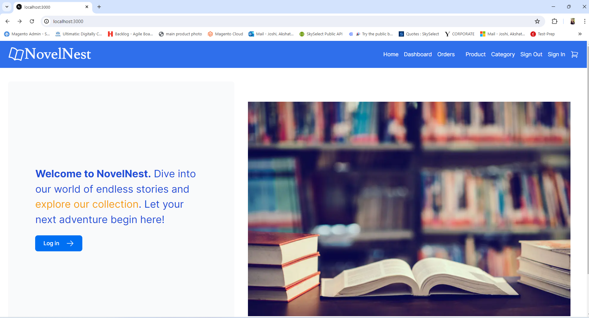
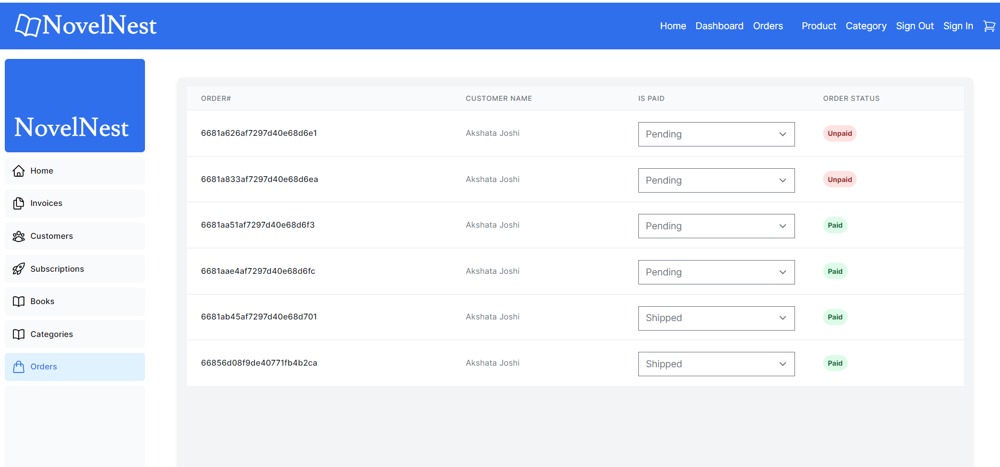
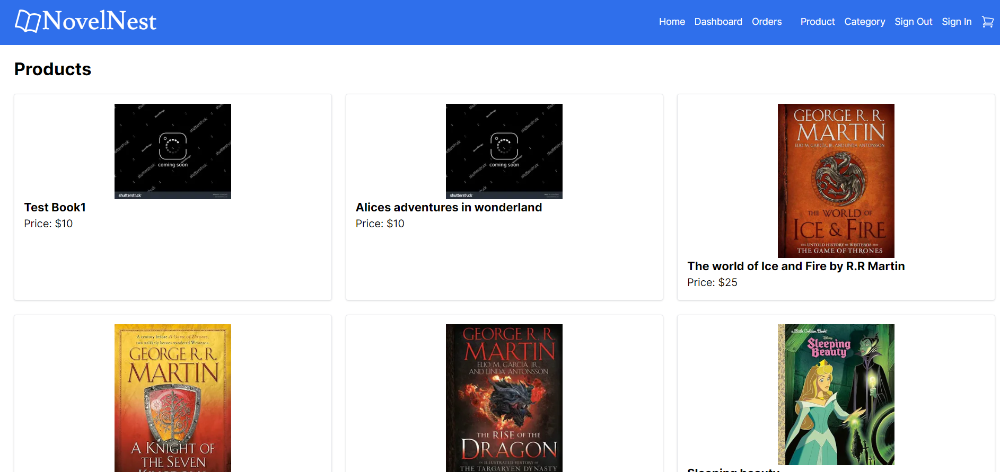
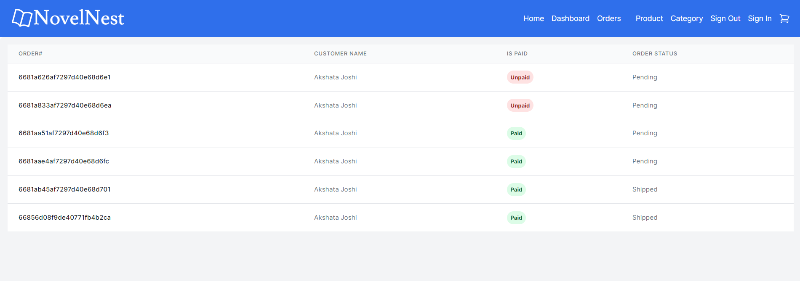

This is a Bookstore [Next.js](https://nextjs.org/) project bootstrapped with [`create-next-app`](https://github.com/vercel/next.js/tree/canary/packages/create-next-app).

## Getting Started

First, run the development server:

```bash
npm run dev
# or
yarn dev
# or
pnpm dev
# or
bun dev
```

Open [http://localhost:3000](http://localhost:3000) with your browser to see the result as below.
Or the same can be accisible from vercel URL: [https://bookstore-nextjs-three.vercel.app/]



You can start editing the page by modifying `app/page.tsx`. The page auto-updates as you edit the file.

Admin Dashboard can be accesible from `app/dashboard/page.tsx`.
This Page provides admin user to see all the details of customer and their orders.


Even Admin can add or update the Book `app/dashboard/Books/page.tsx`.
Even they are allow to search the product.


Admin able to create new customers `app/dashboard/customers/addCustomer/page.tsx


Admin able to create new category, assign book to a category and update the category even they allow to filter or search the category.


Admin able to create a subscription based product and even update the product. Even they are allow to set the status of the listing pending or active.


Admin allow to manage all customer's orders and its status, they can modify the order status and even can see the what are the orders are paid and some of them are yet to make a payment.



As a Customer they can see the same Home page.


As a customer they have access to see all the list of product uisng `app/products/page.tsx`.
Here they can see product Name, Image and Price.



A Product detail page can be modify from `app/product/[id]/page.tsx`.


Customer can do add to cart from the product detail page. The cart i manged on the page context level. Where this been managed at Header level so thruout all the pages cart value has the same. cart context can be modify from `app/lib/CartContext.tsx`.


Customer can place an actual order to our application using the credit cart[right now we can only use TEST credit cards].
Sample Card number: 4111 1111 1111 1111
Sample Expiry Date: 07/28
Sample CVV: 123


Customer can see all the orders and they can track its status from there, this page can be modify from `app/orders/page.tsx`.



This project uses [`next/font`](https://nextjs.org/docs/basic-features/font-optimization) to automatically optimize and load Inter, a custom Google Font.

## Learn More

To learn more about Next.js, take a look at the following resources:

- [Next.js Documentation](https://nextjs.org/docs) - learn about Next.js features and API.
- [Learn Next.js](https://nextjs.org/learn) - an interactive Next.js tutorial.

You can check out [the Next.js GitHub repository](https://github.com/vercel/next.js/) - your feedback and contributions are welcome!

## Deploy on Vercel

The easiest way to deploy your Next.js app is to use the [Vercel Platform](https://vercel.com/new?utm_medium=default-template&filter=next.js&utm_source=create-next-app&utm_campaign=create-next-app-readme) from the creators of Next.js.

Check out our [Next.js deployment documentation](https://nextjs.org/docs/deployment) for more details.